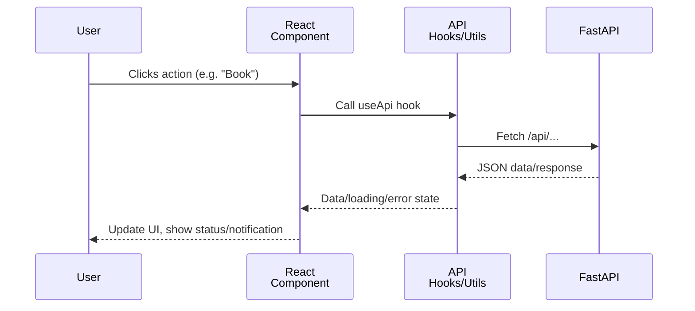

# Appointment Frontend App (React)

This application is the React-based frontend for MedBook's appointment system, providing a modern, minimalistic interface for both patients and doctors to manage appointments, view notifications, and handle their profiles.

---

## Architecture Overview

The frontend is a single-page React application, featuring:

- **Component-based structure** (pure React, no heavy frameworks)
- **API integration layer** in `/src/api` that manages all communication with the FastAPI backend
- **Role awareness** UX — UI logic changes based on patient or doctor role
- **Airbnb-inspired UI/UX**: Modern colors, responsive layouts, card-style components, and smooth user experience
- **State and Auth Handling**: Context and hooks for session/authentication management

```mermaid
graph TD
    A[App.js Router] --> B[Auth Context<br/>Session]
    A --> C[Navbar/Sidebar]
    A --> D[Pages]
    D --> D1[Login/Register]
    D --> D2[Dashboard]
    D --> D3[Profile]
    D --> D4[AppointmentsListing]
    D --> D5[Booking]
    D --> D6[SlotManagement]
    D --> D7[NotificationCenter]
    D7 --> E[API Integration (src/api/index.js)]
    E --> F["Backend API (FastAPI)"]
```

---

## Main Features

- **Authentication and Registration**: Separate flows for patients and doctors
- **Role-based Navigation**: Patients and doctors see different UI and options
- **Profile Management**: Edit profile and details in a dedicated UI
- **Book Appointments**: Patients can browse doctors, see available slots, and book
- **Slot Management**: Doctors manage (add, edit, delete) available slots
- **Appointment Listing & Actions**: Both roles view and manage their appointment requests
- **Real-time Notifications**: Polling-based notification center for status and request updates
- **Responsive Minimal Design**: Accessible, modern, and mobile-friendly

---

## Component & Data Flow

1. **AuthProvider (`auth.js`)** supplies authentication state/context to all components and handles token/session persistence.
2. **Navigation** adapts to the logged-in role, showing role-appropriate links, notification center, and logout options.
3. **API Requests** are routed through `/src/api/index.js` which standardizes all backend communication (token injection, error handling).
4. **Pages (e.g. `Dashboard.js`, `Profile.js`, `DoctorListAndBooking.js`)** display user flows according to role.
5. **NotificationCenter** polls for real-time updates and displays appointment/booking status.



---

## API Integration

All API communication is managed via `src/api/index.js`:

- Utility `apiRequest` wraps all fetch logic, injects JWT tokens, and handles JSON/error parsing
- Custom React hooks (e.g. `useAppointments`, `useDoctors`, `useDoctorSlots`, `useProfile`, `useNotifications`) abstract API operations and sync view state
- Frontend expects backend REST API as described in [backend docs](../../medbook-appointment-system-17676-17698/appointment_backend_api/kavia-docs/README.md)

---

## Setup Guide

### Prerequisites

- Node.js (v18+ recommended)
- npm (v9+), included with Node

### Installation

```bash
cd medbook-appointment-system-17676-17699/appointment_frontend_app
npm install
```

### Usage/Development

```bash
npm start
```
By default, this runs the app in development mode at [http://localhost:3000](http://localhost:3000).

### Production Build

```bash
npm run build
```
Builds static production-ready assets to `build/`.

---

## Configuration & Theming

- Colors and theme settings are defined in `/src/App.css`
- Theme (light/dark) toggling is built-in (auto-detected or user-switchable)
- Layout is responsive, with sidebar navigation and header, card layouts for content, and modals for forms

---

## Design Decisions

- **Minimal dependencies**: No UI library; only React and necessary utilities.
- **Centralized API Layer**: All API logic is in `/src/api`, enabling easy backend changes.
- **Role-based UI**: User experience differs for patients and doctors; slot management and booking flows are strictly divided.
- **Airbnb-inspired Look**: Color scheme, layout, and feedback mimic modern user-facing platforms.
- **Accessibility**: Keyboard navigation, clear focus, and readable fonts are prioritized.

---

## Major User Flows

### For Patients

1. Register or log in
2. Browse doctor list/slots — see available time blocks
3. Book appointment
4. Check appointment status in "Appointments" or notifications
5. Update profile or log out

### For Doctors

1. Register or log in
2. Add/manage available time slots in "Slot Management"
3. Receive booking notifications/requests from patients
4. Confirm/reject appointments
5. Update profile or log out

---

## Testing

- Tests located in `/src/__tests__/`
- Run with: `npm test`
- Coverage includes component rendering, role switching, and basic flows

---

## Extending & Customizing

- To add new API endpoints, extend the utilities/hooks in `/src/api/`
- Additional UI features (pagination, richer profiles) can hook into the standardized context and data flow
- The App supports enhancements like real-time WebSocket notifications or i18n with minor adjustments

---

## Troubleshooting

- Ensure backend API is running and accessible at expected URL/port
- Adjust proxy settings in `package.json` or CORS in backend if needed for local development
- See React and FastAPI docs for further configuration if deploying

---

## See Also

- [API Integration Layer Documentation](../src/api/README.md)
- [Backend System Documentation](../../medbook-appointment-system-17676-17698/appointment_backend_api/kavia-docs/README.md)
